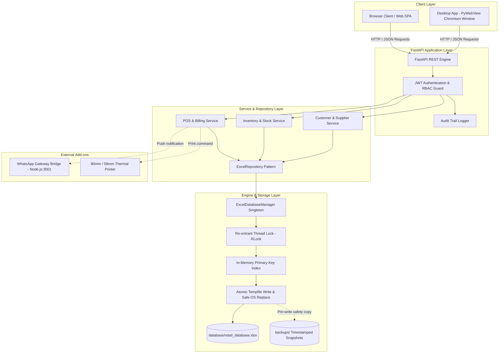

# SmartRetail — Excel-Powered Commercial POS & Retail ERP

<div align="center">


%20%2B%20openpyxl-217346?logo=microsoftexcel&logoColor=white)


-brightgreen)

**A high-performance, production-ready Retail Shop Management System and Point of Sale (POS) application powered by FastAPI, an industrial-strength atomic Excel database engine, and a lightweight Vanilla JavaScript Single Page Application (SPA).**

[Features](#-core-features) • [Licensing](#-commercial-offline-licensing-system) • [Architecture](#-architecture--engine-design) • [Quick Start](#-quick-start--installation) • [Desktop App](#-desktop-application--exe-packaging) • [Demo Credentials](#-default-demo-credentials) • [Contact Developer](#-developer-contact--license-inquiries)

</div>

---

## 📖 Overview

**SmartRetail** bridges the gap between the simplicity of spreadsheets and the power of a modern retail ERP. It allows small-to-medium retail businesses (supermarkets, grocery stores, hardware shops, electronics stores, boutiques) to manage sales, stock, customers, suppliers, and finances without requiring complex SQL databases (PostgreSQL/MySQL), cloud subscriptions, or heavy front-end frameworks.

Data is stored transparently inside **`database/retail_database.xlsx`**, allowing business owners to open, audit, and analyze their records directly in Microsoft Excel, LibreOffice, or Google Sheets at any time.

---

## ✨ Core Features

### 🛒 High-Speed Point of Sale (POS) Counter
* **Barcode Scanner Ready:** Real-time barcode reader integration with instant sound feedback (beep / error tone).
* **Multi-Modal Product Search:** Instant search by Barcode, Item Name, Category, or SKU with live keyboard shortcuts.
* **GST & Tax Computation:** Automated tax breakdown (CGST, SGST, IGST) with customizable slab rates.
* **Flexible Payments:** Support for Single and Split Payments (**Cash**, **Card**, **UPI Dynamic QR Code**, and **Customer Credit Ledger**).
* **Dynamic UPI QR Code Generation:** Generates on-screen NPCI-compliant UPI QR codes linked to the bill amount for immediate customer payment.
* **Thermal Receipt Printing:** Instant 80mm & 58mm POS thermal receipt generation with shop branding, tax summary, invoice footer, and QR codes.
* **WhatsApp Invoice Delivery:** Automated receipt delivery directly to the customer's WhatsApp number via local WhatsApp gateway.
* **Register Shift Management:** Opening float, mid-day cash-in/cash-out tracking, cash drop reconciliation, and end-of-day register closure reports.

### 📦 Inventory & Stock Control
* **16-Sheet Structured Schema:** Products, Categories, Stock Ledger, Inward Purchases, Supplier Dues, Adjustments, and Returns.
* **Real-time Stock Deductions:** Automatic live balance synchronization on checkout and purchase returns.
* **Low Stock Alerts & Notifications:** Automated threshold monitoring with fast-reorder alerts.
* **Batch Inward Orders:** Track supplier consignments, purchase invoices, unit costs, and profit margins.
* **Stock Ledger Tracking:** Immutable audit history of every stock increment, sale, adjustment, return, and scrap event.

### 👥 Customer & Supplier Ledgers
* **Customer Khata (Credit Accounts):** Track outstanding store credit, record partial settlements, and view customer purchase histories.
* **Supplier Due Management:** Inward purchase payments, credit ledger tracking, and supplier payoff histories.

### 💰 Expenses & Financial Analytics
* **Expense Tracker:** Categorized operational expenses (rent, utilities, salaries, maintenance).
* **Visual Dashboard (Chart.js):** Real-time KPI cards for Daily Gross Sales, Net Profit, Inventory Valuation, and Top-Selling Products.
* **Sales Trends & Analysis:** Daily, weekly, and monthly sales breakdowns with interactive charts.

### 🛡️ Enterprise Security & 4-Tier RBAC
Enforced strictly at the API layer (JWT + dependency injection) and frontend navigation:
| Role | Permissions & Access Scope |
|---|---|
| **Admin** | Unrestricted master access across all modules, settings, user management, audit trails, and backups. |
| **Manager** | Products, stock approvals, purchase orders, expenses, customer ledger, and analytical reports. |
| **Cashier** | High-speed POS billing counter, customer registration, sale lookups, and receipt printing. |
| **Stock Manager** | Inventory counts, stock adjustments, supplier inward orders, and purchase management. |

### 🔐 Commercial Offline Licensing System

SmartRetail includes an offline-first cryptographic licensing engine. Retail stores do not require active internet connections to validate licenses.

#### Available License Formats
* **1-Year Access Format (`1_year`):** Valid for 365 days from activation with real-time remaining day countdown (`Expires in X days`) and renewal alerts.
* **Lifetime Access Format (`lifetime`):** Perpetual unrestricted access with no expiration prompts.
* **7-Day Evaluation Trial:** Automatic grace period on fresh systems before mandatory key activation.

#### Client & Developer Workflow
1. **User Finds Machine ID:**
   - The user opens the app or the **Terminal Login screen** and clicks **`🔑 Hardware ID & License`** (or goes to **Settings > Commercial License**).
   - Their unique 16-character **Hardware Machine ID** (`XXXX-XXXX-XXXX-XXXX`) is displayed with a 1-click **📋 Copy Machine ID** button and direct **💬 WhatsApp** share button.
2. **User Sends Machine ID to Developer:**
   - The user sends their Machine ID to the developer via WhatsApp or Email.
3. **Developer Generates Signed License Key:**
   - The developer runs the CLI tool to generate a cryptographically signed key locked to that PC:
     ```bash
     # 1-Year license locked to client's PC (365 days)
     python -m backend.app.core.license_tool generate --client "Super Store" --type 1_year --machine-id "FF74-C077-3FDB-C88D"

     # Lifetime license locked to client's PC (never expires)
     python -m backend.app.core.license_tool generate --client "Super Store" --type lifetime --machine-id "FF74-C077-3FDB-C88D"

     # Floating key (unbound, works on any PC)
     python -m backend.app.core.license_tool generate --client "Super Store" --type lifetime --machine-id ANY
     ```
4. **User Pastes Key & Activates:**
   - The user pastes the key (starting with `SRL1Y-` or `SRLFT-`) in Step 2 and clicks **"⚡ Activate License"**.
   - Immediate offline HMAC-SHA256 signature verification unlocks the system.


---

## 🏗 Architecture & Engine Design



### 🔒 Industrial-Strength Excel Database Engine
SmartRetail uses an advanced **`ExcelDatabaseManager`** layer over `openpyxl` designed to eliminate traditional spreadsheet concurrency issues:
1. **Re-entrant Thread Locking (`threading.RLock`):** Protects multi-threaded FastAPI workers from colliding or corrupting the workbook.
2. **In-Memory O(1) Indexing:** Fast primary key resolution and caching prevents slow sheet traversals.
3. **Atomic File Swapping:** Writes first to an isolated temporary file (`tempfile.NamedTemporaryFile`) and performs an atomic filesystem replace (`os.replace`) upon validation. An unexpected power outage or server crash will **never** corrupt your primary database.
4. **Pre-Write Automated Snapshots:** Creates rotating timestamped backups in `backups/` before any heavy schema update or data write.

---

## 📁 Repository Structure

```
excel-pos/
├── backend/
│   ├── app/
│   │   ├── core/
│   │   │   ├── audit.py             # Audit trail event logger
│   │   │   ├── config.py            # Pydantic environment settings
│   │   │   ├── dependencies.py      # JWT auth & role validation dependencies
│   │   │   ├── excel_db.py          # Atomic thread-safe Excel database engine
│   │   │   └── security.py          # Bcrypt hashing & JWT token issuance
│   │   ├── models/                  # Pydantic schemas (requests & responses)
│   │   ├── repositories/            # Repository pattern abstraction for Excel
│   │   ├── routers/                 # 18 Modular REST API endpoints
│   │   ├── services/                # Business logic & multi-sheet transactions
│   │   ├── init_db.py               # Workbook initializer & default seeds
│   │   ├── seed_demo_data.py        # Rich realistic retail catalog seeder
│   │   └── main.py                  # FastAPI application & static asset mounter
├── frontend/
│   ├── css/                         # Modular CSS (themes, layouts, components)
│   ├── js/                          # Vanilla JS controllers (POS, stock, reports, auth)
│   ├── index.html                   # Main single page application (SPA) shell
│   └── login.html                   # Login screen with 1-click test credentials
├── database/
│   └── retail_database.xlsx         # Primary Excel workbook database
├── backups/                         # Automatic & manual timestamped snapshots
├── tests/                           # Pytest automated test suites
├── whatsapp-bridge/                 # Local Node.js WhatsApp Web gateway bridge
├── desktop_app.py                   # PyWebView standalone desktop wrapper
├── build_desktop.py                 # PyInstaller production executable builder
├── run.py                           # Unified local launcher (FastAPI + Bridge + Web)
├── requirements.txt                 # Python dependencies
├── .env.example                     # Environment template
└── README.md                        # Documentation
```

---

## ⚡ Quick Start / Installation

### 1. Prerequisites
* **Python 3.10+** (Tested up to Python 3.14)
* **Node.js 18+** *(Optional, required only for local WhatsApp receipt bridge)*
* **Modern Web Browser** (Chrome, Edge, Brave, Firefox, or Safari)

### 2. Clone the Repository
```bash
git clone https://github.com/your-username/smart-retail-pos.git
cd smart-retail-pos
```

### 3. Create a Virtual Environment
```bash
# Windows (PowerShell)
python -m venv venv
.\venv\Scripts\Activate.ps1

# Linux / macOS
python3 -m venv venv
source venv/bin/activate
```

### 4. Install Dependencies
```bash
pip install -r requirements.txt
```

### 5. Setup Environment File
Copy the sample environment file:
```bash
# Windows
copy .env.example .env

# Linux / macOS
cp .env.example .env
```

### 6. Initialize & Seed the Excel Database
Initialize the 16 sheets and default system accounts:
```bash
python -m backend.app.init_db
```

*(Optional but recommended)* Pre-populate the database with comprehensive demo products, categories, suppliers, customers, and stock:
```bash
python -m backend.app.seed_demo_data
```

### 7. Run the Application

#### Option A: Web Mode (FastAPI + Browser Auto-launch)
```bash
python run.py
```
* **Web UI:** [http://localhost:8000](http://localhost:8000)
* **Interactive Swagger Docs:** [http://localhost:8000/docs](http://localhost:8000/docs)
* **ReDoc:** [http://localhost:8000/redoc](http://localhost:8000/redoc)

#### Option B: Standalone Desktop Window (PyWebView)
```bash
python desktop_app.py
```
Runs SmartRetail in a native, frameless desktop window with no external browser dependency.

---

## 🔑 Default Demo Credentials

The database comes pre-seeded with accounts for all four system roles:

| Role | Username | Default Password | Primary Dashboard View |
|---|---|---|---|
| **Admin** | `admin` | `Admin@12345` | Master Analytics, Users, Backups & Audit Logs |
| **Manager** | `manager` | `Manager@12345` | Products, Stock Approvals, Expenses & Reports |
| **Cashier** | `cashier` | `Cashier@12345` | High-Speed POS Billing Counter |
| **Stock Manager** | `stockmanager` | `Stock@12345` | Inventory Count, Inward Orders & Adjustments |

> [!IMPORTANT]
> Change all default passwords immediately before deploying in a live commercial environment via **Settings > User Management**.

---

## ⚙️ Environment Variables & Configuration

The application is configured using a `.env` file in the root directory:

| Key | Default Value | Description |
|---|---|---|
| `SECRET_KEY` | `retail_super_secret_jwt_key_...` | Cryptographic secret key for signing JWT tokens. |
| `ALGORITHM` | `HS256` | JWT signing algorithm. |
| `ACCESS_TOKEN_EXPIRE_MINUTES`| `720` (12 Hours) | JWT session validity duration. |
| `HOST` | `127.0.0.1` | Local listening host address. |
| `PORT` | `8000` | HTTP port for the FastAPI server. |
| `ENVIRONMENT` | `development` | `development` or `production`. |
| `EXCEL_DB_PATH` | `database/retail_database.xlsx`| Relative or absolute path to primary Excel file. |
| `BACKUP_DIR` | `backups/` | Storage folder for automated database backups. |
| `CURRENCY_SYMBOL` | `₹` | Default symbol for receipts and UI displays. |
| `SHOP_NAME` | `Smart Retail Supermarket` | Business trade name printed on receipts and invoices. |
| `DEFAULT_TAX_RATE` | `5.0` | Default GST tax percentage for newly created items. |

---

## 🖥️ Desktop Application & EXE Packaging

You can compile SmartRetail into a standalone Windows executable (`.exe`) with bundled assets and runtime dependencies.

### One-Click Desktop Executable Build
Run the automated PyInstaller builder:
```bash
python build_desktop.py
```
This will:
1. Clean previous build artifacts (`build/` and `dist/`).
2. Package the FastAPI backend, Uvicorn, and Python runtime.
3. Bundle the `frontend/` static assets and `database/retail_database.xlsx`.
4. Produce a self-contained executable in:
   ```
   dist/SmartRetail/SmartRetail.exe
   ```

To test the desktop version without compiling:
```bash
python desktop_app.py
```

---

## 📱 WhatsApp Receipt Gateway Bridge

SmartRetail includes an optional zero-cost local WhatsApp integration using `whatsapp-web.js`:
1. Navigate to `whatsapp-bridge/`:
   ```bash
   cd whatsapp-bridge
   npm install
   ```
2. Start the gateway server:
   ```bash
   node server.js
   ```
3. Scan the terminal QR code using WhatsApp on your store's mobile device.
4. During checkout in POS, toggle **Send WhatsApp Receipt** to automatically send PDF/formatted text invoices to the customer's phone number.

---

## 🧪 Testing & Quality Assurance

SmartRetail comes with a complete automated test suite powered by `pytest` and `httpx`:

```bash
# Run all test suites
pytest -v

# Run concurrency and thread-safety tests
pytest tests/test_concurrency_safety.py -v

# Run authentication and RBAC authorization tests
pytest tests/test_auth_rbac.py -v

# Run end-to-end business flow tests (Inward -> Sale -> Stock Check)
pytest tests/test_business_flow.py -v

# Run POS cash register closure tests
pytest tests/test_register_closure.py -v
```

---

## 🤝 Contributing

Contributions are welcome! Please follow these steps:
1. Fork the repository.
2. Create a descriptive feature branch:
   ```bash
   git checkout -b feature/amazing-feature
   ```
3. Commit your changes:
   ```bash
   git commit -m "Add amazing new retail feature"
   ```
4. Push to your branch:
   ```bash
   git push origin feature/amazing-feature
   ```
5. Open a **Pull Request**.

---

## 📞 Developer Contact & License Inquiries

For software inquiries, custom white-label deployments, or to obtain **1-Year** or **Lifetime** commercial license keys, contact the developer directly:

| Contact Channel | Details / Direct Link |
|---|---|
| **Lead Developer** | **Rudra Sarkar** |
| **Support Email** | [contact@RUDRA SARKAR](rudrasarkar02@gmail.com) |
| **Official Website / Repo** | [SmartRetail GitHub Repository](https://github.com/Rudra031/Retail-Shop-Management-System/) |

> [!TIP]
> **How to Request a Commercial License Key:**
> When contacting the developer, please provide:
> 1. **Your Store / Business Name** (e.g. *Apex Supermarket*)
> 2. **Your Hardware Machine ID** (Click **`🔑 Hardware ID & License`** on the app's topbar or login screen to copy your `XXXX-XXXX-XXXX-XXXX` ID)
> 3. **Desired Plan**: **1-Year Subscription** or **Lifetime Perpetual Access**

---

## 📄 License

Distributed under the **MIT License**. See `LICENSE` for details.

---

<div align="center">
  <sub>Built with ❤️ for independent retailers and small businesses worldwide.</sub>
</div>
